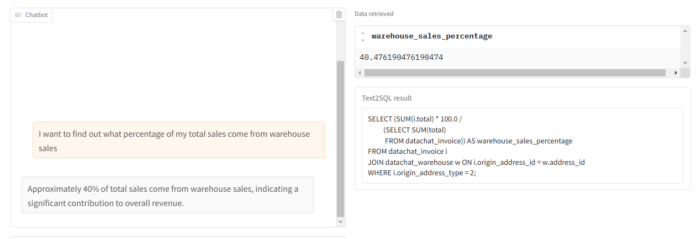

# Setup
## Installation
```bash
pip install -r requirements.txt
```
## Create API key
```
https://jigsawstack.com/dashboard
https://console.groq.com/
https://menlo.ai/
https://e2b.dev/
```

# Pipeline


# Demo
- Prompt 2

- Prompt 1

- Prompt 3


